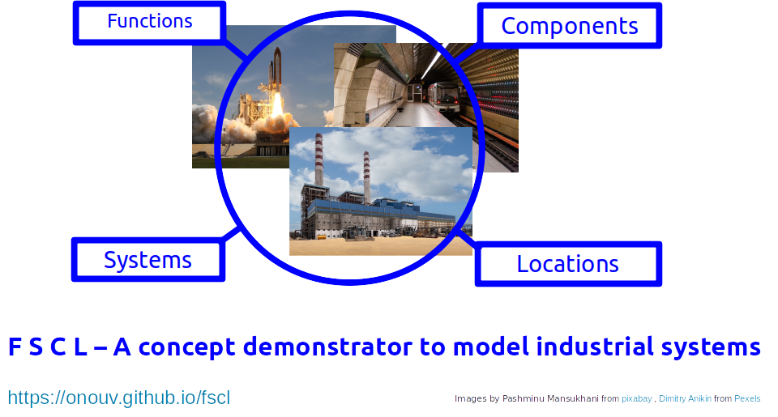

# What is FSCL ?
FSCL is a tool to model industrial systems from the following simple artefacts:

* ***Functions*** - specifications of distinct elements of performance or behaviour
  * *for example, in an elevator system "Transport Passenger"*

* ***Systems***     - logical groupings of *components* to perform a set of common functions
  * *for example, in an elevator system "Drive System" or "Independent Brake System"*

* ***Components***  - physical or software artefacts (parts)
  * *for example, in an elevator system "Drive Motor" "Brake Magnet"*

* ***Locations***   - places where *components* are installed
  * *for example, in an elevator system "Machine Room", "Shaft Floor 1", "Concourse Floor 1"*  

Find more details on the motivation [here](doc/fscl/Intro.md) 

# What is FSCL NewGen ?

I have refactored the original concept by defining a set of [application views](doc/fscl/Views/Views.md) and I am in the process of implementing a **NewGen of FSCL** based on these concepts, which you will find in this repo. If the views before have been simply the Functions, Systems, Components and Locations described above, they are now defined with much more focus on real-world application purpose (at least in my mind :-). The four core concepts (FSCL) have now become elements of a common distributed [data management concept](doc/fscl/data-management-concept/Data%20Management%20Concept.md).

Find a more detailed explanation of this **core domain model** [here](doc/fscl/core-domain-model/Core%20Domain%20Model.md).

Find an outline of the new **architecture** [here](doc/fscl/architecture/Architecture.md).

Find the [original FSCL demonstrator here](https://github.com/onouv/fscl/tree/master).

# Artefacts

FSCL NewGen is currently in development. It will consist of various artefacts. Please also refer to the [Project Plan](doc/fscl/Project%20Plan.md)

## Supporting Artefacts
[fscl-core-lib](https://github.com/onouv/fscl-core-lib/tree/newgen)

## Process Technology View
[fscl-process-service](https://github.com/onouv/fscl-process-service)  
[fscl-process-ui]() (TO BE DONE)

## Automation View
TO BE DONE

