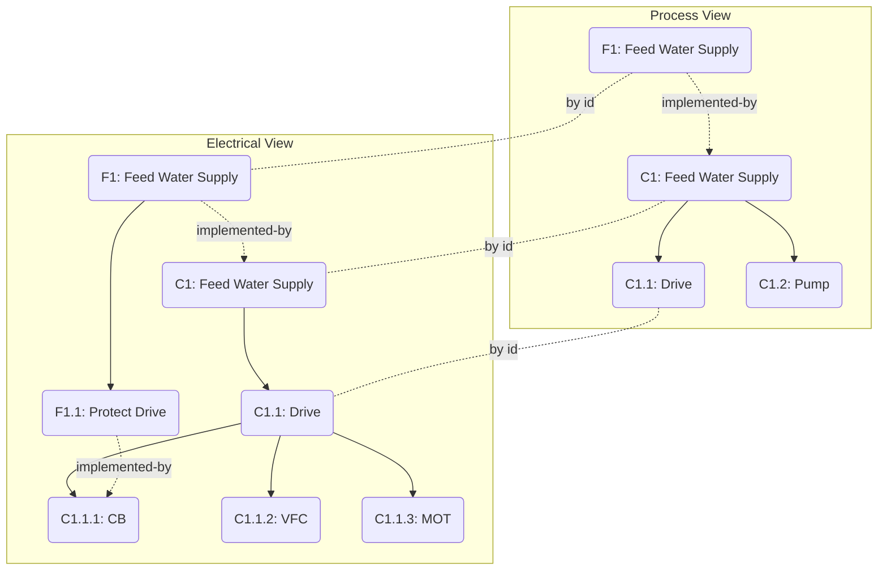

# Information Model

## Overview

 A **Function** represents a well described purpose, performance or purposeful behavior of a technical unit or process.  Example: Controlled Deceleration of a Train (Braking).

A **Component** represents a tangible piece of equipment or a unit of software which can independently deployed and tested. In both cases, the Component must be designed to fulfill a specific purpose (implement Functions). Example:  Driver Brake Valve in a Train.

A **System** represent a conglomerate of components and subsystems and is designed to fulfill a specific purpose (Function). Example: Train Brake System.    

A **Location** - well, yeah. Exactly

All **Entities** may carry **Parameters**. These allow to attach Metainfo to them which can be used for future parametric design features or just as an explicit expression of design assumptions or results.

Any Entity can be referenced by **Views**. **Views** are collections of entities which are enriched by additional view-specific semantics and to allow modeling of a specific aspect when engineering a system. Examples: Automation View, Electrical Engineering View, Safety and Reliability View.   

## Functions 

**Parent**: indicates that a Function owns another one as an integral part. The owned Function may also be called a sub function of its owner. Semantically it means that a parent function may use a sub function at any time during its own execution. 

**FunctionLinks**: (Abstract) may connect Functions in different sub trees and on different levels of decomposition. 

**Exclude** indicates that activity of the source  Function implies the execution of the target.
Example: Braking Excludes Accelerating, Opening Doors excludes Closing Doors

**Require**:  like the parent-child relation, require indicates that a Function needs another one to execute and may use it at any time during its own activity, but it doesn't imply ownership, just dependency.
Example: Braking requires Air Supply

Use of Require and Exclude is mutually exclusive.

### Components

One or more **Components** may implement one or more **Functions**.

Components may be composed of sub components. 

A **System** may consist of one or more **Components**.

A **Location** may hold one or more **Components**, i.e. Components may be installed at a Location. It is intended that the Component breakdown structure will provide leaf elements that contain exactly one Component, but multiple components may also be lumped into one location.  In the first case, only one **holds** relation may be modelled, and it must be at the leaf Location (i.e. don't repeat this relation type for all parent locations). 

**ComponentLink:** indicates a physical connection between two **Components**. Intended to allow specific views to mark such a view-specific connection for other views without specifying any view particulars.

## Locations

## Links
In general, Links may be spanning between different trees within the same view but also across different views, within the semantics expressed by the Core Domain Model.  

### Links Within Same View
To represent a link in the first case, the entities concerned simply hold references to each other.

### Links Across Views
In the latter case, a pair of the entities concerned must be present in both views to represent the link. They must have the same id. Both views may further detail their respective trees in different ways. 

>[!info] Example
>within the [Process View](../Views/process-view.md), a Function F1 "Feed Water Supply" may be implemented by a High-Level Component C1 of the same name. The latter is broken down into sub components by the process specialist such as a C1.1 electrical drive and a C1.2 actual pump and giving them some performance parameters.
In an [Electrical View](../Views/electrical-view.md), the drive component will be broken down further into a C1.1.1 Circuit breaker, C1.1.2 Variable Frequency Converter and C1.1.3 Electrical Motor.
The Electrical View will hold the similar instances to the process view, but in addition will hold children of the component. The Electrical View may also refine the functions into specific sub functions such as "Protect Pump Drive" and may link this function as implemented by the Circuit Breaker component. From that Circuit Breaker component though, it will not be possible to  link directly back to anything in the process view, as this link belongs to the components parent. 

