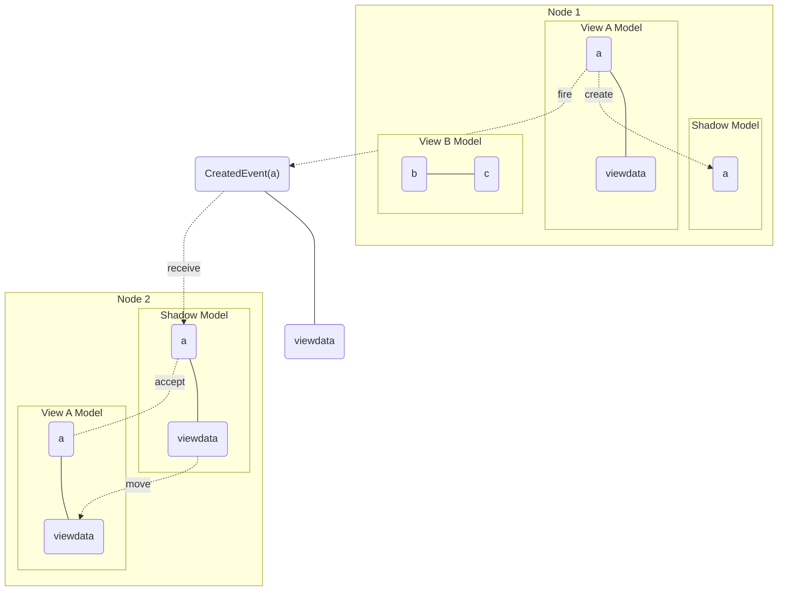

# Data Management Concept  

There is a [Core Domain Model](../core-domain-model/Core%20Domain%20Model.md) containing certain domain entities and links between them. Both of these things we call elements. The main characteristics of this core model are:
* the entities are structured in deep hierarchy trees (parent-child in 1-n)
* the entities may be linked within and across these trees 

## Links
In general, Links may be spanning between different trees within the same view but also across different views, within the semantics exressed by the [[Core Domain Model]].  

### Links Within Same View
To represent a link in the first case, the entities concerned simply hold references to each other.

### Links Across Views
In the latter case, there must be a pair of the entities concerned present in both views to represent the link. They must have the same id. Both views may further detail their respective trees in a different way. 

>[!info] For example, 
>within the [[Process View]], a Function F1 "Feed Water Supply" may be implemented by a High-Level Component C1 of the same name. The latter is broken down into sub components by the process specialist such as an C1.1 electrical drive and an C1.2 actual pump and giving them some performance parameters.
In an [[Electrical View]], the drive component will be broken down further into a  C1.1.1 Circuit breaker, C1.1.2 Variable Frequency Converter and C1.1.3 Electrical Motor.
The Electrical View will hold the similar instances to the process view, but in addition will hold children of the component. The Electrical View may also refine the functions into specific sub functions such as "Protect Drive" and may link this function to the Circuit Breaker component to indicate that this coponent implements the function.

For brevity we do not show links but only parent-child relations in the diagrams below but they are conceptually equally treated as *elements*. In an implementation, this responsibility may be mapped on to different artifacts. For example, Links may be represented as either a separate class or as references within the link partners.  

## Key Requirements

1) We want to  **avoid a centralized data storage** for this complex information:
* to avoid a performance bottleneck
* to avoid a reliability problem (single point of failure)
* to allow easy addition and changing of views without having to change existing code bases of existing views or of a central service

2) We must **ensure all views are eventually updated** about all changes in all views, so they can *decide if a change is relevant for them*. This decision ideally should not even bother the view user, but it may have to in many cases.

3) A view may be processed on **any number of computational nodes**. A node may process **any number of different views**. 

## Solution Concept

Each node maintains a separate complete copy of the common model (**shadow model**). Each view on a node must maintain its view specific model (**view model**) and a complete copy he latter is eventually maintained consistent with all other views. There is no central copy of either the common shadow model or any view model.  

Different Views  maintain a different selection (sub trees and link sets) of these elements, i.e. a view model may choose only a subset of all elements in the shadow model. However, the relations of the elements that are picked must be maintained consistent on both models (e.g `a` is parent of `b` in both models):

The shadow model contains  only elements that carry information relevant for **all** views. Currently, this consitutes:
- a `projectId`
- an element `id`, unique within the project
- a parent id
- element `id`s of all children
- a `name`
- a textual `description`

Note that an element just created cannot contain any children, so initially, there is no children data.

For each view, there may be multiple replicas (micro service instances). Therefore, a mechanism must be defined to distribute view-specific data in a addition to the data just described for an element across all replicas.  This is achieved on the domain event level by assigning a payload with such data for the originating view only, which must be ignored by other views, but must be moved into the view model by the applicable view.

The graphics be shows two Nodes, both containing a View A, one node in addition contains a View B. When in Node 1, View A a new element `a` is created and is endowed with some viewdata sepecific to View A. An event is sent out, informing any view in other nodies about the new element. Upon receiving the event in Node 2, the new element is brought into the local shadow model, together with the viewdata applicable to View A. 

View A finds the element with applicable data and automatically accepts the element inti its view model. The viewdata is moved from the shadow model into the view model. This process would happen identically on any node with a View A after receiving the event.

Note that View B on Node 1 is not doing anything, as it has decided the element `a` does not concern it. 

## View Creates New Element

When a view wants to create a new element, 

(1) it must check in the shadow model if there already is an appropriate candidate.  If there is, it must decide if that should be used 

If there is no such candidate or if it shall not be used, the view must
(2) create a new element in the view model
(3) dito in the shadow model
(4) link the two	
(5) Publish the creation event to the bus, so other views can react to it (see below)

(6 When a view on the same client which has just created the element subsequently receives the creation event from the bus (by means of its subscription), it must ignore it, since it already finds the  element in its shadow

(7) When one of the other views receives the creation event, they will not find the element in their shadow model copy and will introduce it to its shadow model. They must eventually propose the new element for decision wether or not it should be introduced to the view model. 

The overall workflow looks like this:  

  

## View Deletes an Element

When a View decides to delete an element, a consensual decision must be made wether or not this should happen in the shadow models of all views as well.

The Deleting View must 
(1) delete the element from its view model and shadow model
(2) publish the fact to the bus (DELETE event)
(3) flag the shadow element with DELETED 

The bus spreads the DELETE event to all views

(3) When the initiating view receives the DELETE event, it finds the element flagged as DELETED, and therefore ignores the event

(4) other views which are not using the element in their respective view models must delete the shadow element once they receive the DELETE event

(5) other views which DO use the element in their own model view must NOT delete anything, but instead 

(6) issue a RECREATE event for that very element, so that 

(7) any view that is NOT using the element in its view model must  **create it in shadow model with eventual proposal for view model**  and

(8) the view which originally initated the deletion can trigger a **reset the DELETED flag in the shadow element without eventual proposal for view model** 

