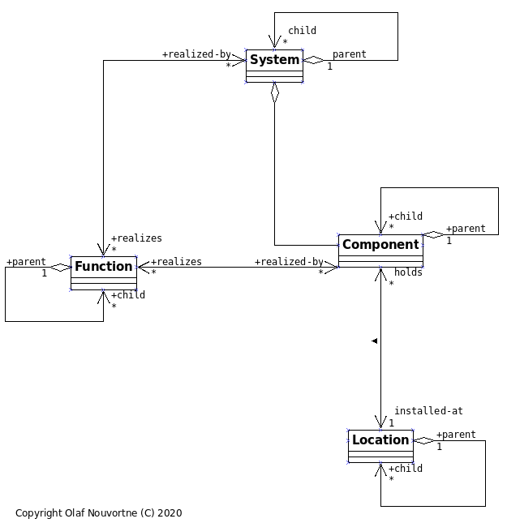
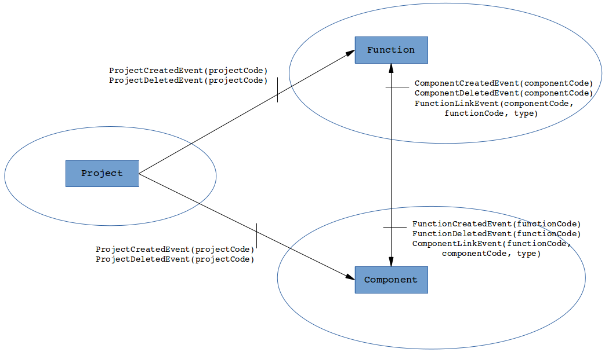
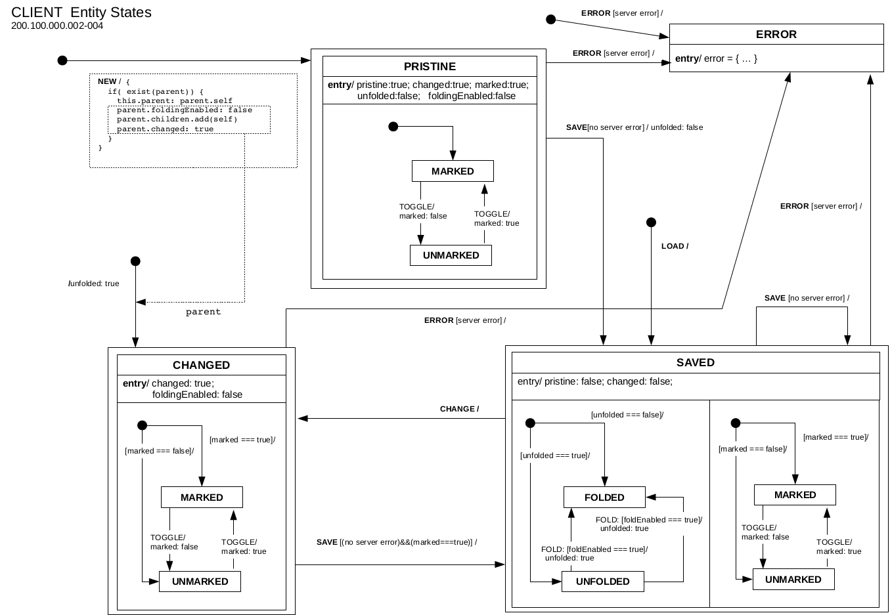

# FSCL Architecture

## Core Object Model

Please look at this UML diagram as an overview or the core object model:

Functions, Systems, Components and Locations are all organized in hierarchical
parent-child structures. Certain relations between these entities are modelled
as well.

Currently, the demonstrator deals with *Function* and *Component* entities,
omitting *Location* and *System* artefacts for brevity. In addition, a *Project*
artefact must be introduced to provide a context for the entities above.

## Bounded contexts

Following a simple domain driven design, the *bounded contexts* for
this subset look like this:

There are three aggregates (*Project*, *Function*, *Component*). The web client
provides a view for each of these three to the users.

Each of these aggregates can be created or deleted by the users. This will create
the associated domain events shown above to notify the other context. In addition, users
may link *Components* to *Functions* and vice versa. This will trigger further
domain events for linking and unlinking, respectively.

## Microservices

There are currently three of them:

* **`project-service`**:  manages the *Project* aggregate
   * serving the REST api associated with the aggregate to the web client
   * managing persistency with database
   * emitting domain events as defined in the `fscl-project-api` library

* **`function-service`**: manages the *Function* aggregate, which involves:
   * serving the REST api associated with the aggregate to the web client
   * managing persistency with database
   * emitting domain events as defined in the `fscl-function-api` library
   * handling domain events as defined in the `fscl-component-api` and `fscl-project-api`

* **component-service**: manages the *Component* aggregate
   * serving the REST api associated with the aggregate to the web client
   * managing persistency with database
   * emitting domain events as defined in the `fscl-component-api` library
   * handling domain events as defined in the `fscl-function-api` and `fscl-project-api`

The microservices are built based on **Spring Boot**. Messaging of domain events is done by means of **Kafka** and **Spring Cloud Stream**. Database is **MongoDB**. While microservices
obviously can and should be implemented independently from each other, a deliberate and
probably highly opinionated choice has been made to reuse as much purely *common* functionality as possible. This has been put into the classes in `fscl-core-lib` library. This is mostly repetitive stuff dealing with entities as such, e.g. generating and managing consistent and unique id for entities (look at the `fscl.core.domain.registration` package).

Please note as this is purely a concept demonstrator, no efforts have been made (yet)
to maintain transactional consistency.

## Web Client

The web client provides user views for
* [**Function**](client/src/function)
   * create, delete, edit *Functions* and sub-functions
   * link/ unlink *Components* to *Functions*

* [**Component**](client/src/component)
   * create, delete, edit *Components* and sub-components
   * link/ unlink *Functions* to *Components*

* [**Project**](client/src/project) aggregate
   * create, delete, edit *Projects*

Each of these views is built from React.js components, mostly setup in [`lib`](client/src/lib).
Here, all stateless ui components are assembled in [`lib\ui`]. The client heavily uses [`react-redux`](https://react-redux.js.org/). Therefore, all state is rooted in [`store.js`](client/src/store.js). There is one view-specific reducer for each view, e.g.
[`FunctionReducer.js`](client/src/function/redux/FunctionReducer.js), and a couple
generic specialized sub-reducers in ['client/src/lib/redux'](client/src/lib/redux)
Each *Redux-Action* lives in its own file named after the Action. All redux code is
collected in a `redux` folder either in the view folder or in lib.

All view components are built as ***stateless functional components***, connecting to the store  through their ***container*** function. This is intended to make testing easier (most of test code to be done, yet).  A view component will live in a folder named after
the component. The stateless functional component will be named with a UI suffix
(see [FunctionLst](client/src/function/FunctionList) as an example).

Each of the entities (*Function*, *Component*) is shown as a line in a List.
Sub-entities can be folded out and back in (hidden). to support this behavior,
entities follows a life cycle defined by this state machine, 

which is supported in the [domain classes](client/src/lib/domain).
